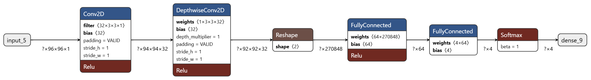

# HandGestureRecognition
Hand Gesture Recognition for rock, paper, scissors recognition user tensorflow lite for edge devices deployment

## Sample Data From Rock Class
<div style="display: flex;">
  
  
</div>

## Sample Data From Paper Class
<div style="display: flex;">
  
  
</div>

## Sample Data From Scissors Class
<div style="display: flex;">
  
  
</div>

## Model
The model has a 2D convolution layer followed by a depthwise separable convolutional layer then a classification layer with 2 linear layers of sizes 64 and 4



The model is trained for 20 epochs using adam optimizer and learning rate of 0.003. Categorical cross-entropy loss is employed and accuracy is used as validation metric. After trainind, post-training quantization is employed to convert the model to Int8 type. The trained models are available in **models** directory.

## Model Metrics
Accuracy and inference time on the test set comparison between the float 32 model and the quantized model.
| Model Type | Accuracy | Inference Time Per Sample (ms) |
|------------|----------|--------------------------------|
| Float 32   | 0.81     | 11.5117                        |
| Int 8      | 0.81     | **8.2841**                     |


## Model Profiling Results

| Model Name (with link to the profiler output) | Number of Layers | MAC Count (millions) | Model File Size (MB) | Runtime Memory Size (MB) | Inference/s | MAC/s  |
|------------------------------------------------|------------------|----------------------|-----------------------|--------------------------|-------------|--------|
| Float32 Model                             | 6                | 22.3                 | 69.3                  | 2.2                      | 2.4819      | 55.4M  |
| Int8 Model                                | 8                | 22.3                 | **17.3**              | **0.5563**                 | **2.455**   | **54.8M**  |


## Application
Create a Python environment with packages:
```
conda create -n tflite python=3.10 -y
conda activate tflite
pip3 install tensorflow numpy matplotlib python-opencv gradio 
```

To run the gradio application, use the following command:
```
python3 gradio_app.py
```